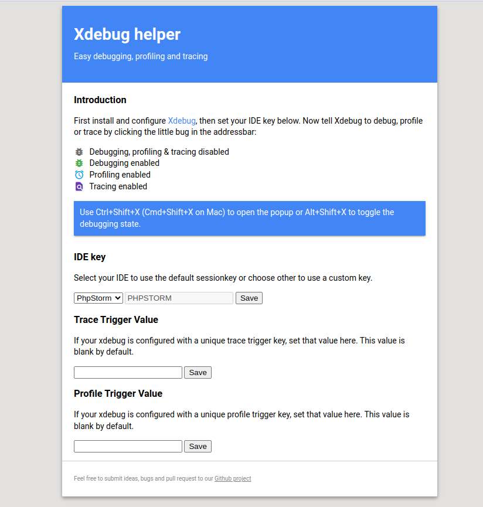
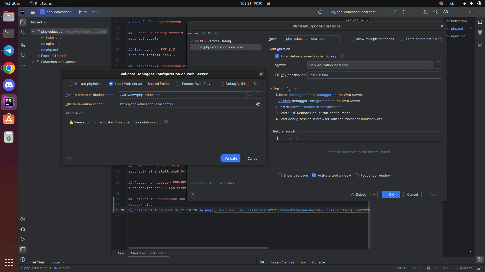

# Що таке PHP?

**PHP (Hypertext Preprocessor)** — це серверна мова програмування, яка спеціально розроблена для створення динамічних веб-сторінок та веб-додатків.
  PHP легко інтегрується з HTML і широко використовується для розробки серверної частини веб-сайтів.


##PHP використовується для:

- Генерації динамічних сторінок, які можуть змінюватися залежно від введених користувачем даних або інших факторів.
- Обробки форм на веб-сайтах.
- Взаємодії з базами даних для зберігання та отримання інформації.
- Створення повноцінних веб-додатків, таких як системи управління контентом (CMS), форуми, блоги тощо.
- Розробки API для взаємодії з іншими додатками.

## Коли створили?

PHP був створений Расмусом Лердорфом у 1994 році. Спочатку це був набір скриптів для відстеження відвідувачів його особистої веб-сторінки, але з часом він перетворився на потужну мову програмування.

## Які версії є?

PHP має декілька основних версій, кожна з яких принесла нові функції та покращення:

- **PHP/FI 2.0 (1995)**: Перша офіційна версія.
- **PHP 3 (1998)**: Переписана версія з новим синтаксисом і можливістю розширення.
- **PHP 4 (2000)**: Впроваджена машина Zend Engine, покращена продуктивність і підтримка сесій.
- **PHP 5 (2004)**: Додані об'єктно-орієнтовані можливості, підтримка PDO, покращена робота з XML.
- **PHP 6**: Проєкт з повною підтримкою Unicode, який не вийшов через технічні проблеми.
- **PHP 7**: Випущений після невдачі PHP 6, зосереджений на продуктивності, новий Zend Engine 3.0, типізація скалярів, нові оператори та видалення застарілих функцій.
- **PHP 8 (2020)**: Введено нову JIT-компіляцію, покращення продуктивності, нові можливості мови.

# Команди для встановлення

## Оновлення списку пакетів
sudo apt update

## Встановлення PHP 8.3
sudo apt install php8.3

## Встановлення розширення Xdebug для PHP 8.3
sudo apt-get install php-xdebug

# Відкриття конфігураційного файлу для Xdebug
sudo pluma /etc/php/8.3/fpm/conf.d/20-xdebug.ini

# Додавання налаштувань для Xdebug

```
zend_extension=xdebug.so
xdebug.mode=debug
xdebug.client_host=127.0.0.1
xdebug.XDEBUG_SESSION=PHPSTORM
xdebug.idekey=PHPSTORM
xdebug.client_port=9003
xdebug.start_with_request=yes
```

## Встановлення PHP-FPM 8.3
sudo apt-get install php8.3-fpm

## Перезапуск сервісу PHP-FPM 8.3
sudo service php8.3-fpm restart

## Встановити розширення для браузера :
xdebug-helper



## Налаштування для phpstorm

